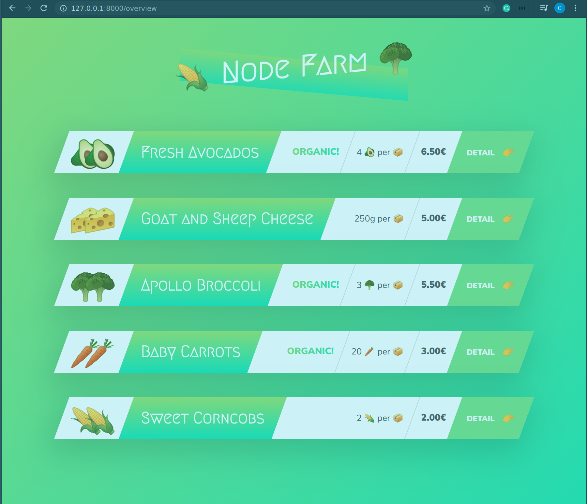
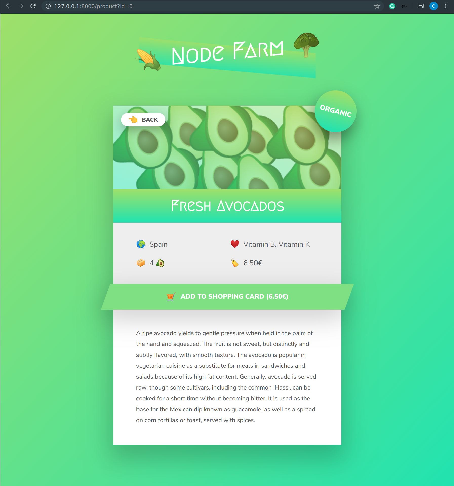

# NODE FARM

A simple Node Farm App build with HTML/CSS, Javascript and NodeJs. The project is an introduction to Server side development with Nodejs.

## App Screenshot

### Overview Page



### Product Details



## Code Snippets

```Javascript
const fs = require('fs');
const http = require('http');
const url = require('url');

/////////////////////////////////////////////////
// SERVER
// Replace template
const replaceTemplate = (temp, product) => {
   let output = temp.replace(//g, product.productName);
   output = output.replace(//g, product.image);
   output = output.replace(//g, product.price);
   output = output.replace(//g, product.from);
   output = output.replace(//g, product.nutrients);
   output = output.replace(//g, product.quantity);
   output = output.replace(//g, product.description);
   output = output.replace(//g, product.id);
   if (!product.organic) {
      output = output.replace(//g, 'not-organic');
   }
   return output;
}

const overviewTempl = fs.readFileSync(`${__dirname}/templates/overview_template.html`, 'utf-8');
const cardTempl = fs.readFileSync(`${__dirname}/templates/card_template.html`, 'utf-8');
const productTempl = fs.readFileSync(`${__dirname}/templates/product_template.html`, 'utf-8');


const data = fs.readFileSync(`${__dirname}/dev-data/data.json`, 'utf-8');
const dataObj = JSON.parse(data);
// console.log(dataObj);

const server = http.createServer((req, res) => {
   const { query, pathname } = (url.parse(req.url, true));
   // const pathName = req.url;

   // OVERVIEW PAGE
   if (pathname === '/' || pathname === '/overview') {
      res.writeHead(200, { 'content-type': 'text/html' });
      
      const cardsHtml = dataObj.map(el => replaceTemplate(cardTempl, el)).join('');
      const output = overviewTempl.replace('', cardsHtml);
      res.end(output);


      // PRODUCT PAGE
   } else if (pathname === '/product') {
      console.log(query);
      res.writeHead(200, { 'content-type': 'text/html' });
      const product = dataObj[query.id];
      const output = replaceTemplate(productTempl, product);
      res.end(output);


      // API
   } else if (pathname === '/api') {
      res.writeHead(200, { 'content-type': 'application/json' });
      res.end(data);

      // PAGE NOT FOUND
   } else {
      res.writeHead(404, {
         'Content-type': 'text/html',
         'My-own-header': 'Hello-there!'
      });
      res.end('<h1>The page you are asking for does not exist!</h1>');
   }
});

server.listen(8000, '127.0.0.1', () => {
   console.log('Listenning to requests on port 8000');
});
```
